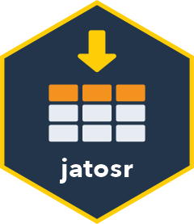

# jatosr <a href="https://www.gfrischkorn.org/jatosr/"></a>

<!-- badges: start -->
[](https://github.com/GidonFrischkorn/jatosr/actions/workflows/R-CMD-check.yaml)
<!-- badges: end -->

An R client for the [JATOS](https://www.jatos.org) REST API. Your API token
lives in the credential store of your operating system, never in a script and
never in a file in the clear. The package lists
studies, batches and components, checks the token, generates study codes,
downloads result data and uploaded files incrementally into a local
cache, and turns the jsPsych JSON files into one tibble of trials with the
metadata of each run joined, saved as `.rds`, `.csv`, `.csv.gz`, `.tsv`,
`.parquet` or `.RData` together with the study-result table, a provenance record and, on request, the
study archive, in a single call. The
retrieval workflow is modelled on the JATOS functions in
[smartr](https://github.com/chenyu-psy/smartr) by Chenyu Li.
[jatosR](https://github.com/visionlabels/jatosR) by Jiri Lukavsky is a
related package with a thinner surface.

## Installation

```r
# install.packages("pak")
pak::pak("GidonFrischkorn/jatosr")
```

Once the package is on CRAN, `install.packages("jatosr")` installs the
released version.

Version 0.1.0 is being tested on the machines of a few lab members before it
goes to CRAN. If you take part, or simply try it, the "Beta test report" form
under Issues asks for what a report needs; `data-raw/check-keyring.R` checks
the credential store of your machine without touching your own profiles.

## Set up credentials once

Create a personal access token in JATOS (user menu, "API tokens"), then:

```r
library(jatosr)
jatos_set_credentials("https://jatos.example.org")   # prompts for the token
```

The token goes into your operating system's credential store — the macOS
keychain, the Windows credential store, the Secret Service on Linux (see
"Headless machines" in `vignette("credentials")` for what Linux needs). The
server's URL, which is not a secret, goes into a small configuration file
under `tools::R_user_dir()`. Every later session picks both up, and nothing
token-shaped goes into your scripts.

On a server, in a container or in CI, set `JATOS_TOKEN` (and `JATOS_HOST`)
from the platform's own secret store instead. Environment variables are read
first, so that path needs no credential store at all.

A second account on the same server, or a second server, is a named profile,
stored side by side:

```r
jatos_set_credentials("https://jatos.example.org", profile = "lab_admin")
jatos_list_profiles()                      # what is set, without the tokens
jatos_credentials_sitrep()                 # where each token comes from
admin <- jatos_connection("lab_admin")     # or set JATOS_PROFILE=lab_admin
jatos_studies(conn = admin)
jatos_remove_credentials(profile = "lab_admin")   # take it out again
```

## Use

```r
jatos_token_info()     # who am I, is the token active

studies <- jatos_studies()
studies[, c("study_id", "title", "active")]

jatos_batches(studies$study_id[1])

# metadata, filter, incremental download, read, join, write: one call.
# Writes data/study12.rds (trials), data/study12_metadata.rds (one row per
# study result) and data/study12_export.json (what produced them); the
# data/ directory must exist.
trials <- jatos_export_results(
  study_id = 12, cache = "JATOS_data", file = "data/study12.rds",
  states = "FINISHED"
)

# what a download would fetch, without a request
meta <- jatos_results_metadata(study_id = 12)
jatos_download_results(meta, "JATOS_data", dry_run = TRUE)
jatos_cache_status("JATOS_data")

# files participants uploaded (drawings, recordings), same incremental rule
jatos_result_files(meta)
jatos_download_files(meta, "JATOS_data")

# the study archive (.jzip) that reproduces the experiment, and the results
# archive as the server builds it (for a data deposit)
jatos_export_study(12, "data/study12_study.jzip")
jatos_export_archive(study_id = 12, file = "data/study12_results.zip")

# the same dataset from the cache alone, without credentials
jatos_export_results(
  study_id = 12, cache = "JATOS_data", file = "data/study12.rds",
  states = "FINISHED", download = FALSE, overwrite = TRUE
)

# a zip exported from the JATOS GUI becomes a cache
jatos_import_results("~/Downloads/jatos_results.zip", "JATOS_data")
```

A connection holds no token at all — only the profile it uses, so printing,
saving or caching one cannot leak a secret:

```r
jatos_connection()
#> <jatos_connection>
#>   profile: default
#>   host:    https://jatos.example.org
#>   api:     https://jatos.example.org/jatos/api/v1
#>   token:   from the credential store
```

## Roadmap

Built: credentials, study structure, result
metadata (ids or uuids), incremental download with dry run and cache
status, uploaded files, the study and results archives, import of a
results zip, field extraction, JSON readers with a reader of your own,
raw files per participant, study codes, vignettes, the metadata join, the
writers, filters, URL query columns, the provenance record and the
offline export. Open before the CRAN release: the beta test on other
machines and credential stores, and three checks of the download against
a live JATOS.

## Other platforms

I run my studies on JATOS and recruit through Prolific, and that workflow
sets the priorities of this package; hosts such as Pavlovia, Gorilla or
PsyToolkit are not on my list unless a study of mine lands there. If you
work on one of them, take `jatosr` as a template: the credential handling,
the request builder, the metadata contract and the incremental cache are
independent of JATOS and meant to be copied. `vignette("developer-notes")`
says which parts those are and how to start; `CONTRIBUTING.md` has the
development cycle. Sibling packages with the same shape could one day be
bundled as `onlinestudies`, once there is more than one.
